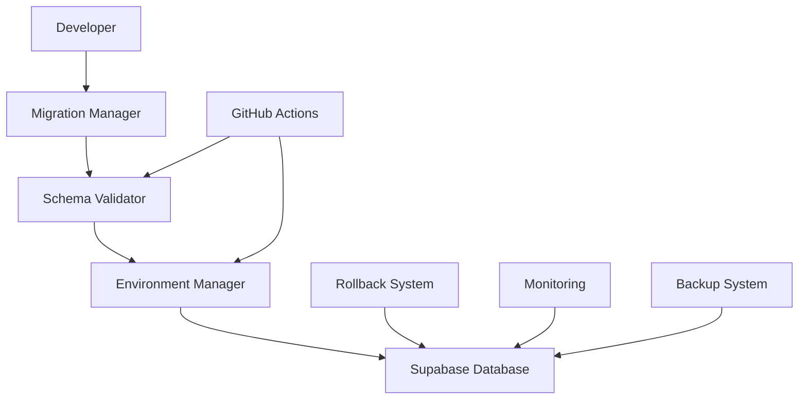

# Database Version Control System

## Overview

This document describes the comprehensive database version control system implemented for TalkWeb.ai. This system provides safe, reliable, and auditable database changes that integrate seamlessly with our hybrid Git workflow.

## Table of Contents

1. [System Architecture](#system-architecture)
2. [Migration Management](#migration-management)
3. [Rollback Procedures](#rollback-procedures)
4. [Environment Management](#environment-management)
5. [GitHub Integration](#github-integration)
6. [Monitoring and Validation](#monitoring-and-validation)
7. [Best Practices](#best-practices)
8. [Troubleshooting](#troubleshooting)

## System Architecture

### Components



### File Structure

```
database/
├── rollbacks/              # Rollback SQL files
├── snapshots/              # Environment snapshots
├── backups/                # Database backups metadata
├── comparisons/            # Environment comparison reports
├── sync-logs/              # Migration sync logs
├── branches/               # Branch-specific configurations
└── archives/               # Archived configurations

scripts/database/
├── migration-manager.js    # Migration creation and execution
├── schema-validator.js     # Schema validation and impact analysis
└── environment-manager.js  # Environment management
```

## Migration Management

### Creating Migrations

```bash
# Create a new migration with rollback
npm run db:migration:create "add_user_preferences" \
  "CREATE TABLE user_preferences (id UUID DEFAULT gen_random_uuid(), ...);" \
  "DROP TABLE IF EXISTS user_preferences CASCADE;"

# Create migration interactively
node scripts/database/migration-manager.js create "feature_name"
```

### Migration File Structure

```sql
-- Migration: Add user preferences
-- Created: 2024-01-16T12:00:00.000Z
-- Type: UP

-- Create user preferences table
CREATE TABLE public.user_preferences (
  id UUID NOT NULL DEFAULT gen_random_uuid() PRIMARY KEY,
  user_id UUID NOT NULL REFERENCES auth.users(id) ON DELETE CASCADE,
  theme TEXT DEFAULT 'light',
  language TEXT DEFAULT 'en',
  notifications JSONB DEFAULT '{}',
  created_at TIMESTAMP WITH TIME ZONE DEFAULT now(),
  updated_at TIMESTAMP WITH TIME ZONE DEFAULT now()
);

-- Enable RLS
ALTER TABLE public.user_preferences ENABLE ROW LEVEL SECURITY;

-- Create policies
CREATE POLICY "Users can manage their own preferences"
ON public.user_preferences
FOR ALL
TO authenticated
USING (auth.uid() = user_id)
WITH CHECK (auth.uid() = user_id);

-- Create updated_at trigger
CREATE TRIGGER update_user_preferences_updated_at
BEFORE UPDATE ON public.user_preferences
FOR EACH ROW
EXECUTE FUNCTION public.update_updated_at_column();
```

### Rollback File Structure

```sql
-- Rollback: Add user preferences
-- Created: 2024-01-16T12:00:00.000Z
-- Type: DOWN

-- Drop trigger first
DROP TRIGGER IF EXISTS update_user_preferences_updated_at ON public.user_preferences;

-- Drop table (policies are dropped automatically)
DROP TABLE IF EXISTS public.user_preferences CASCADE;
```

### Migration Status Tracking

```bash
# Check migration status
npm run db:migration:status

# Example output:
✅ 20240115_120000_add_user_roles (2024-01-15T12:00:00.000Z)
✅ 20240116_120000_add_user_preferences (2024-01-16T12:00:00.000Z)
⏳ 20240117_120000_add_notification_settings
```

## Rollback Procedures

### Automatic Rollback

```bash
# Rollback specific migration
npm run db:migration:rollback "20240116_120000_add_user_preferences"

# Rollback to specific point
node scripts/database/migration-manager.js rollback --to "20240115_120000_add_user_roles"
```

### Rollback Validation

Before executing rollbacks, the system:

1. **Creates backup**: Automatic pre-rollback backup
2. **Validates SQL**: Checks rollback script syntax and safety
3. **Checks dependencies**: Verifies no dependent objects
4. **Simulates rollback**: Tests rollback in transaction (if supported)

### Emergency Rollback Protocol

```bash
# Emergency rollback with immediate backup
EMERGENCY=true npm run db:migration:rollback "migration_name"

# This will:
# 1. Create immediate backup
# 2. Skip validation steps
# 3. Execute rollback immediately
# 4. Send notifications
```

## Environment Management

### Environment Validation

```bash
# Validate current environment
npm run db:env:validate production

# Validate all environments
for env in development staging production; do
  npm run db:env:validate $env
done
```

### Environment Synchronization

```bash
# Sync migrations to staging
npm run db:env:sync staging

# Compare environments
npm run db:env:compare staging production
```

### Branch Environment Management

```bash
# Initialize environment for feature branch
node scripts/database/environment-manager.js init-branch development feature/user-preferences

# Cleanup branch environment after merge
node scripts/database/environment-manager.js cleanup-branch development feature/user-preferences
```

## GitHub Integration

### Automated Validation

The GitHub Actions workflows automatically:

1. **Validate migrations** before deployment
2. **Create backups** before applying changes
3. **Test rollback scripts** in staging
4. **Generate impact reports** for production changes

### PR Database Checks

```yaml
# .github/workflows/pr-database-check.yml
name: Database Migration Check

on:
  pull_request:
    paths:
      - 'supabase/migrations/**'
      - 'database/rollbacks/**'

jobs:
  validate-migrations:
    runs-on: ubuntu-latest
    steps:
      - uses: actions/checkout@v4
      - name: Validate migrations
        run: |
          for migration in supabase/migrations/*.sql; do
            if [ -f "$migration" ]; then
              echo "Validating: $migration"
              node scripts/database/schema-validator.js validate "$migration"
              
              # Check for rollback file
              basename=$(basename "$migration" .sql)
              rollback="database/rollbacks/${basename}_rollback.sql"
              if [ ! -f "$rollback" ]; then
                echo "❌ Missing rollback file: $rollback"
                exit 1
              fi
            fi
          done
```

### Deployment Integration

```bash
# Production deployment with database validation
name: Deploy to Production
on:
  push:
    branches: [main]

jobs:
  deploy-with-db:
    steps:
      - name: Validate Database Changes
        run: |
          # Critical validation for production
          npm run db:env:validate production
          
          # Check for destructive operations
          for migration in supabase/migrations/*.sql; do
            if grep -q "DROP TABLE\|TRUNCATE\|DELETE FROM" "$migration"; then
              echo "❌ Destructive operation detected in: $migration"
              echo "Manual review required"
              exit 1
            fi
          done
      
      - name: Create Production Backup
        run: npm run db:snapshot production "pre_deploy_$(date +%Y%m%d_%H%M%S)"
      
      - name: Deploy Application
        run: npm run build && npm run deploy
```

## Monitoring and Validation

### Schema Validation

```bash
# Create schema snapshot
npm run db:snapshot development "feature_complete"

# Compare with production
node scripts/database/schema-validator.js compare-schemas \
  database/snapshots/development/feature_complete.json \
  database/snapshots/production/baseline.json
```

### Migration Impact Analysis

```bash
# Generate impact report
node scripts/database/schema-validator.js validate supabase/migrations/20240116_120000_add_indexes.sql

# Example output:
{
  "migration": "20240116_120000_add_indexes.sql",
  "validation": {
    "valid": true,
    "issues": [],
    "warnings": [
      {
        "severity": "low",
        "message": "Large table index creation detected",
        "suggestion": "Consider using CONCURRENTLY for production"
      }
    ]
  },
  "estimatedDuration": {
    "estimated": 45,
    "unit": "seconds",
    "confidence": "medium"
  },
  "affectedTables": ["users", "profiles"],
  "rollbackComplexity": "low",
  "recommendations": [
    "Test on staging with production data size",
    "Monitor index creation progress",
    "Consider maintenance window for production"
  ]
}
```

### Continuous Monitoring

```bash
# Monitor database health
node scripts/database/environment-manager.js validate production

# Monitor migration performance
tail -f database/sync-logs/sync_production_*.json
```

## Best Practices

### Migration Development

1. **Always create rollback scripts**
   ```bash
   # Every migration MUST have a corresponding rollback
   migration: 20240116_120000_add_feature.sql
   rollback:  20240116_120000_add_feature_rollback.sql
   ```

2. **Use safe operations**
   ```sql
   -- ✅ Good: Safe operations
   CREATE TABLE IF NOT EXISTS new_table (...);
   ALTER TABLE existing_table ADD COLUMN IF NOT EXISTS new_column TEXT;
   
   -- ❌ Avoid: Destructive operations without safeguards
   DROP TABLE old_table;
   DELETE FROM users WHERE condition;
   ```

3. **Test in staging first**
   ```bash
   # Always test migration path in staging
   npm run db:env:sync staging
   npm run db:migration:rollback staging "migration_name"
   npm run db:env:sync staging  # Re-apply to test both directions
   ```

### Environment Management

1. **Maintain environment parity**
   ```bash
   # Regular environment comparison
   npm run db:env:compare staging production
   ```

2. **Use appropriate validations per environment**
   - **Development**: Lenient validation, allow experimentation
   - **Staging**: Production-like validation, test rollbacks
   - **Production**: Strict validation, require approvals

3. **Create snapshots before major changes**
   ```bash
   # Before feature deployment
   npm run db:snapshot production "pre_feature_release"
   ```

### Rollback Planning

1. **Test rollback scripts**
   ```bash
   # Test rollback in staging
   npm run db:migration:rollback staging "migration_name"
   # Then re-apply to ensure both directions work
   ```

2. **Document rollback impact**
   ```markdown
   ## Rollback Impact Assessment
   - Data loss potential: None/Low/High
   - Downtime required: None/< 5min/< 30min
   - Manual steps required: Yes/No
   - Dependencies: List any dependent systems
   ```

3. **Plan for emergency scenarios**
   ```bash
   # Keep emergency contact list updated
   # Document emergency rollback procedures
   # Test emergency rollback scenarios
   ```

## Troubleshooting

### Common Issues

#### Migration Validation Fails

```bash
# Check SQL syntax
node scripts/database/schema-validator.js validate migration.sql

# Common fixes:
# - Remove auth schema modifications
# - Add IF EXISTS clauses
# - Check for reserved keywords
```

#### Rollback Script Missing

```bash
# Generate rollback template
node scripts/database/migration-manager.js generate-rollback \
  supabase/migrations/20240116_120000_migration.sql \
  --tables "table1,table2" \
  --functions "func1,func2"
```

#### Environment Sync Issues

```bash
# Debug environment connectivity
SUPABASE_URL=your-url SUPABASE_SERVICE_ROLE_KEY=your-key \
  node scripts/database/environment-manager.js validate

# Check environment differences
npm run db:env:compare development staging
```

#### Migration Conflicts

```bash
# Check for conflicting migrations
npm run db:migration:status

# Resolve conflicts by:
# 1. Reviewing migration order
# 2. Merging conflicting changes
# 3. Creating conflict resolution migration
```

### Emergency Procedures

#### Database Corruption

1. **Stop all operations**
   ```bash
   # Stop deployments
   gh run cancel --repo your-repo
   ```

2. **Assess damage**
   ```bash
   # Check database connectivity
   npm run db:env:validate production
   ```

3. **Restore from backup**
   ```bash
   # Use most recent backup
   # This would typically involve Supabase dashboard or API
   ```

#### Failed Migration

1. **Check migration status**
   ```bash
   npm run db:migration:status
   ```

2. **Execute rollback**
   ```bash
   npm run db:migration:rollback "failed_migration_name"
   ```

3. **Validate system state**
   ```bash
   npm run db:env:validate production
   ```

### Performance Issues

#### Slow Migrations

```sql
-- Check migration progress
SELECT 
  pid,
  now() - pg_stat_activity.query_start AS duration,
  query 
FROM pg_stat_activity 
WHERE state = 'active';
```

#### Large Table Operations

```sql
-- For large table modifications, consider:
-- 1. Creating new table
CREATE TABLE users_new AS SELECT * FROM users;

-- 2. Adding constraints
ALTER TABLE users_new ADD CONSTRAINT ...;

-- 3. Swapping tables
BEGIN;
ALTER TABLE users RENAME TO users_old;
ALTER TABLE users_new RENAME TO users;
COMMIT;

-- 4. Cleanup in separate migration
DROP TABLE users_old;
```

## Version Control Integration

### Git Hooks

```bash
# Pre-commit hook to validate migrations
#!/bin/bash
# .git/hooks/pre-commit

for migration in $(git diff --cached --name-only | grep "supabase/migrations/.*\.sql"); do
  echo "Validating migration: $migration"
  node scripts/database/schema-validator.js validate "$migration"
  
  # Check for corresponding rollback
  basename=$(basename "$migration" .sql)
  rollback="database/rollbacks/${basename}_rollback.sql"
  if [ ! -f "$rollback" ]; then
    echo "❌ Missing rollback file: $rollback"
    exit 1
  fi
done
```

### Release Integration

```bash
# Tag database version with code release
git tag -a v1.2.3 -m "Release v1.2.3 with database schema v1.2.3"

# Include database schema in release notes
node scripts/database/schema-validator.js snapshot production "release_v1.2.3"
```

This comprehensive database version control system ensures that all database changes are versioned, validated, and safely deployable across all environments while maintaining the ability to quickly and safely rollback if issues arise.