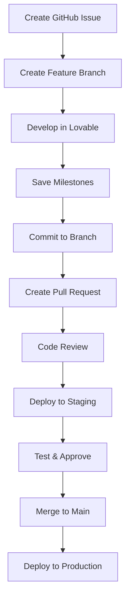

# TalkWeb.ai Development Guidelines

## 🎯 Development Philosophy

We use a hybrid approach combining Lovable's rapid development capabilities with GitHub's professional version control practices.

## 🛠 Development Setup

### Prerequisites
- Access to Lovable project
- GitHub account with repository access
- Node.js 18+ for local development
- Understanding of React, TypeScript, and Tailwind CSS

### Getting Started
1. **Lovable Development**: Primary development environment
2. **GitHub Sync**: Automatic synchronization with repository
3. **Local Development**: Optional for advanced users

## 📝 Coding Standards

### React Components
```typescript
// Use functional components with TypeScript
interface ComponentProps {
  title: string;
  onAction?: () => void;
}

export const Component: React.FC<ComponentProps> = ({ title, onAction }) => {
  return (
    <div className="component-container">
      <h2 className="text-heading">{title}</h2>
      {onAction && (
        <button onClick={onAction} className="btn-primary">
          Action
        </button>
      )}
    </div>
  );
};
```

### Styling Guidelines
- Use semantic tokens from `index.css` and `tailwind.config.ts`
- NO direct colors (avoid `text-white`, `bg-black`, etc.)
- Use design system tokens: `text-primary`, `bg-background`, etc.
- Ensure dark/light mode compatibility

### File Organization
```
src/
├── components/           # Reusable UI components
│   ├── ui/              # Base UI components (shadcn)
│   └── [feature]/       # Feature-specific components
├── pages/               # Page components
├── hooks/               # Custom React hooks
├── utils/               # Utility functions
├── types/               # TypeScript type definitions
└── integrations/        # External service integrations
```

## 🔄 Hybrid Workflow Process

### Daily Development Cycle


### Feature Development Cycle


## 🚀 Development Best Practices

### Lovable Save History
- **Save Frequency**: After each significant change
- **Naming Convention**: `feature: brief description` or `fix: issue description`
- **Use Cases**: 
  - UI/UX iterations
  - Component styling
  - Quick bug fixes
  - Experimental features

### GitHub Commits
- **Commit Frequency**: At stable milestones
- **Message Format**: Follow conventional commits
  ```
  feat: add voice assistant integration
  fix: resolve payment processing error
  docs: update API documentation
  style: improve dashboard layout
  ```

### Code Review Process
1. **Self Review**: Check your own code before requesting review
2. **PR Description**: Use the provided template
3. **Review Criteria**:
   - Functionality works as expected
   - Code follows style guidelines
   - No breaking changes
   - Performance considerations
   - Security implications

## 🧪 Testing Strategy

### Manual Testing
- Test in Lovable preview environment
- Verify responsive design on different screen sizes
- Check dark/light mode compatibility
- Test user interactions and workflows

### Automated Testing
- Unit tests for utility functions
- Component testing for UI components
- Integration tests for API calls

## 📦 Deployment Process

### Staging Deployment
- Automatic deployment from `develop` branch
- Available at `staging.talkweb.io`
- Used for team testing and client previews

### Production Deployment
- Manual deployment from `main` branch
- Available at `talkweb.io`
- Requires code review and approval

## 🚨 Emergency Procedures

### Quick Fixes (< 5 minutes)
1. Identify issue in Lovable Save History
2. Apply fix in Lovable
3. Test in preview environment
4. If stable, commit to hotfix branch

### Critical Production Issues
1. Create hotfix branch from `main`
2. Apply fix and test in staging
3. Fast-track code review
4. Deploy to production
5. Update `develop` branch with fix

## 🔧 Tools and Resources

### Primary Tools
- **Lovable**: Main development environment
- **GitHub**: Version control and collaboration
- **Supabase**: Backend and database
- **Vercel/Netlify**: Deployment (if applicable)

### Development Tools
- **TypeScript**: Type safety
- **Tailwind CSS**: Styling framework
- **shadcn/ui**: UI component library
- **React Query**: Data fetching
- **React Hook Form**: Form management

### Debugging Tools
- Lovable console logs
- Browser developer tools
- Supabase logs and analytics
- GitHub Actions logs

## 📊 Quality Metrics

### Code Quality
- TypeScript strict mode compliance
- ESLint rule adherence
- Component reusability
- Performance optimization

### Development Velocity
- Time from idea to staging
- Number of iterations per feature
- Rollback frequency
- Bug discovery rate

### Team Collaboration
- PR review participation
- Documentation completeness
- Workflow adherence
- Knowledge sharing

## 📚 Learning Resources

### Project-Specific
- [Hybrid Workflow Guide](./HYBRID_WORKFLOW_GUIDE.md)
- [Staging Environment Setup](./STAGING_ENVIRONMENT.md)
- [API Documentation](./API_DOCUMENTATION.md)

### External Resources
- [React Documentation](https://react.dev)
- [TypeScript Handbook](https://typescriptlang.org/docs)
- [Tailwind CSS Documentation](https://tailwindcss.com/docs)
- [Supabase Documentation](https://supabase.com/docs)

---

## 🤝 Getting Help

### For Development Questions
1. Check existing documentation
2. Review similar implementations in codebase
3. Ask in team chat or create GitHub issue
4. Schedule pairing session for complex problems

### For Workflow Questions
1. Reference this guide and workflow documentation
2. Ask team lead or project manager
3. Suggest improvements via GitHub issue

Remember: The goal is to balance rapid development with professional practices. When in doubt, prioritize code quality and team collaboration.