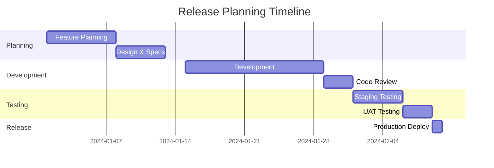
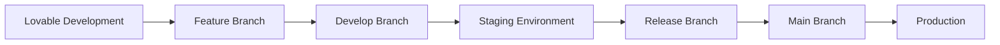

# TalkWeb.ai Release Management

## 🎯 Release Strategy

We follow semantic versioning (SemVer) for all releases: `MAJOR.MINOR.PATCH`

### Version Types
- **MAJOR** (1.0.0): Breaking changes, major feature overhauls
- **MINOR** (0.1.0): New features, backward compatible
- **PATCH** (0.0.1): Bug fixes, security patches

## 📋 Release Process

### Pre-Release Checklist
- [ ] All features tested in staging
- [ ] Code review completed
- [ ] Documentation updated
- [ ] Security scan passed
- [ ] Performance testing completed
- [ ] Backup plan prepared

### Release Steps
1. **Create Release Branch**: `release/v1.2.0`
2. **Final Testing**: Comprehensive testing in staging
3. **Update Documentation**: Version numbers, changelogs
4. **Create Release PR**: Merge to main
5. **Tag Release**: Create GitHub tag and release
6. **Deploy to Production**: Automated deployment
7. **Monitor**: Post-deployment monitoring
8. **Update Develop**: Merge main back to develop

## 🚀 Release Types

### Regular Releases (Monthly)
- Scheduled monthly releases
- Feature additions and improvements
- Non-critical bug fixes
- Performance optimizations

### Hotfix Releases (As Needed)
- Critical security patches
- Production-breaking bug fixes
- Payment processing issues
- Data integrity problems

### Emergency Releases (Immediate)
- Security vulnerabilities
- Data breaches
- Service outages
- Critical business impact

## 📊 Release Planning

### Feature Planning


### Release Calendar
- **Week 1**: Planning and design
- **Week 2-3**: Development and code review
- **Week 4**: Testing and bug fixes
- **Month End**: Production release

## 🔄 Environment Flow



## 📝 Release Documentation

### Changelog Format
```markdown
## [1.2.0] - 2024-02-09

### Added
- New voice assistant integration
- Enhanced analytics dashboard
- WhatsApp business integration

### Changed
- Improved booking workflow
- Updated payment processing
- Enhanced mobile responsiveness

### Fixed
- Calendar sync issues
- Email notification bugs
- Performance optimizations

### Security
- Updated authentication flow
- Enhanced data encryption
- Fixed XSS vulnerabilities
```

### Release Notes Template
```markdown
# Release v1.2.0 - Voice Integration Update

## 🎉 What's New
- **Voice Assistant**: Real-time voice interactions
- **Enhanced Analytics**: Detailed conversation insights
- **Mobile Improvements**: Better mobile experience

## 🐛 Bug Fixes
- Fixed calendar synchronization issues
- Resolved email notification delays
- Improved error handling

## 🚀 Performance
- 30% faster page load times
- Optimized database queries
- Reduced memory usage

## 🔒 Security Updates
- Enhanced authentication security
- Updated dependencies
- Improved data validation

## 📱 Breaking Changes
None in this release.

## 🛠 Migration Guide
No migration required for this release.
```

## 🎯 Quality Gates

### Before Release
- [ ] All automated tests pass
- [ ] Manual testing completed
- [ ] Security scan clean
- [ ] Performance benchmarks met
- [ ] Documentation updated
- [ ] Team approval received

### After Release
- [ ] Deployment successful
- [ ] Smoke tests pass
- [ ] Monitoring alerts clear
- [ ] User feedback positive
- [ ] Performance metrics stable

## 📊 Release Metrics

### Success Metrics
- **Deployment Success Rate**: 99%+
- **Rollback Rate**: <5%
- **Bug Discovery Rate**: <2 critical bugs per release
- **User Satisfaction**: >95%

### Performance Metrics
- **Page Load Time**: <2 seconds
- **API Response Time**: <500ms
- **Uptime**: 99.9%+
- **Error Rate**: <0.1%

## 🚨 Rollback Procedures

### Automatic Rollback Triggers
- Critical errors detected
- Performance degradation >50%
- Security vulnerabilities
- Data corruption

### Manual Rollback Process
1. **Identify Issue**: Confirm rollback needed
2. **Execute Rollback**: Use GitHub revert or Lovable Save History
3. **Verify Stability**: Check all systems operational
4. **Communicate**: Notify team and users
5. **Post-Mortem**: Document issues and improvements

## 🔧 Release Tools

### Automation Tools
- GitHub Actions for CI/CD
- Automated testing pipelines
- Deployment scripts
- Monitoring and alerting

### Manual Tools
- Lovable Save History for quick fixes
- GitHub releases for version management
- Staging environment for testing
- Production monitoring dashboards

## 📅 Release Schedule

### Regular Release Cycle
- **First Monday**: Planning meeting
- **Second-Third Week**: Development
- **Fourth Week**: Testing and bug fixes
- **Last Friday**: Production release

### Emergency Release
- **Immediate**: Critical security issues
- **Same Day**: Production-breaking bugs
- **Next Business Day**: Important fixes

---

## 🤝 Team Responsibilities

### Release Manager
- Coordinate release process
- Ensure quality gates are met
- Communicate with stakeholders
- Manage release timeline

### Development Team
- Complete features on time
- Conduct thorough testing
- Fix bugs before release
- Update documentation

### QA Team
- Test all features thoroughly
- Verify bug fixes
- Perform regression testing
- Sign off on release quality

Remember: Every release should improve user experience while maintaining system stability and security.